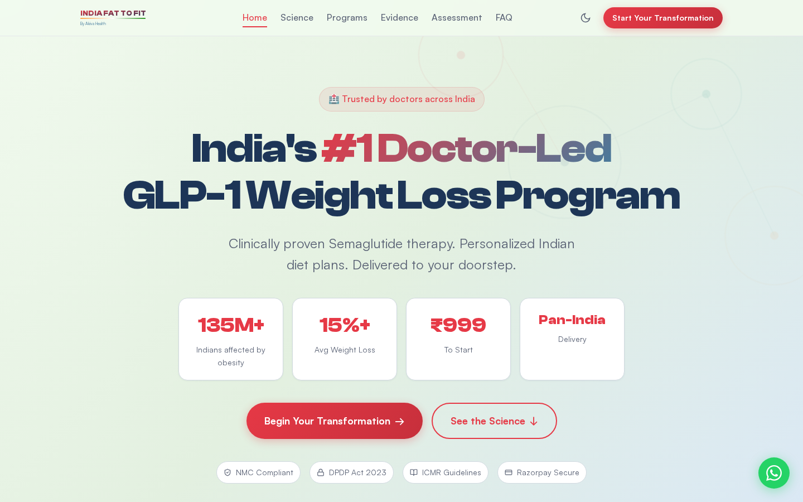
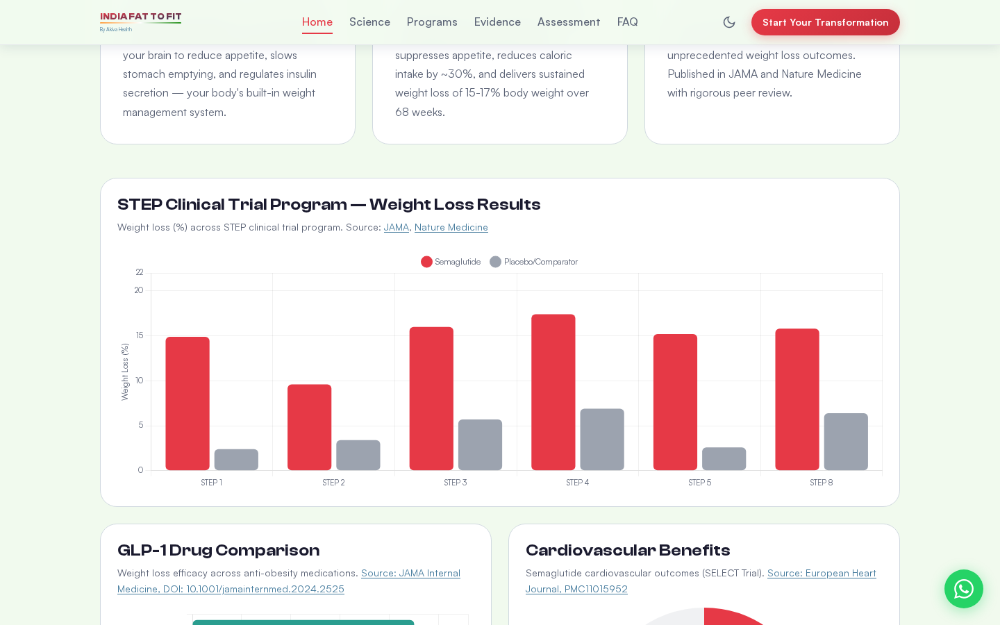
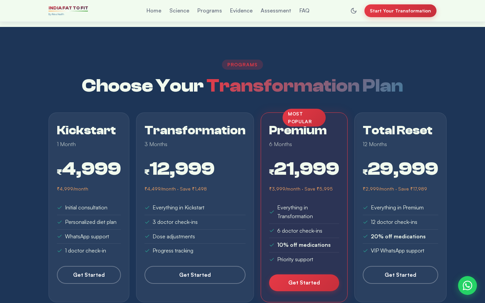
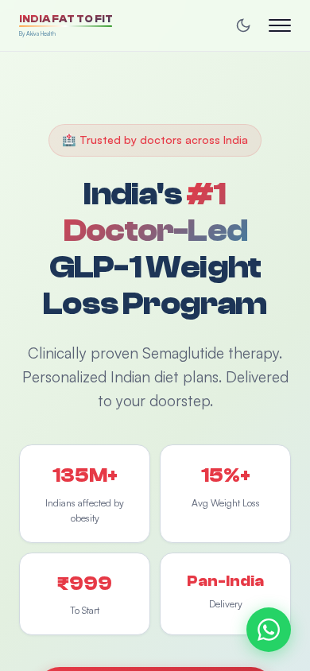

<p align="center">
  
</p>

<h1 align="center">🇮🇳 India Fat to Fit</h1>

<p align="center">
  <strong>India's First Open-Source, Evidence-Based GLP-1 Weight Loss Telehealth Platform</strong>
</p>

<p align="center">
  <a href="https://indiafattofit.com">
    
  </a>
  
  
  
  
  
</p>

<p align="center">
  
  
  
</p>

---

<p align="center">
  
</p>

## The Problem: India's Obesity Epidemic

India has **135 million obese individuals** — the fastest-growing obesity epidemic in the world. According to [NFHS-5 (2019-21)](https://pmc.ncbi.nlm.nih.gov/articles/PMC10611613/), **44% of urban men** and **52% of urban women** are overweight or obese. India now ranks [#2 globally in childhood obesity](https://indianexpress.com/article/health-wellness/india-us-childhood-obesity-second-only-china-children-country-global-report-10564105/) after China.

Yet, there is **no standardized, doctor-supervised, affordable digital platform** for evidence-based weight loss in India — until now.

## The Solution: Clinically Supervised GLP-1 Therapy

**India Fat to Fit** is an open-source telehealth platform that connects patients with licensed physicians for **Semaglutide-based weight loss therapy**, backed by the largest clinical trial program in obesity history — the [STEP trials](https://pmc.ncbi.nlm.nih.gov/articles/PMC9182751/).

<p align="center">
  
</p>

### Key Clinical Outcomes (STEP Trial Program)

| Trial | Weight Loss | vs Placebo | Duration | Journal | DOI |
|-------|-----------|------------|----------|---------|-----|
| [STEP 1](https://pmc.ncbi.nlm.nih.gov/articles/PMC9067867/) | **-14.9%** | -2.4% | 68 weeks | JAMA | 10.4103/2230-8210.342310 |
| [STEP 2](https://pmc.ncbi.nlm.nih.gov/articles/PMC9067799/) | **-9.6%** | -3.4% | 68 weeks | JAMA | 10.4103/2230-8210.342311 |
| [STEP 3](https://pmc.ncbi.nlm.nih.gov/articles/PMC7905697/) | **-16.0%** | -5.7% | 68 weeks | JAMA | 10.1001/jama.2021.1831 |
| [STEP 4](https://pmc.ncbi.nlm.nih.gov/articles/PMC7988425/) | **-17.4%** | +6.9%* | 68 weeks | JAMA | 10.1001/jama.2021.3224 |
| [STEP 5](https://pmc.ncbi.nlm.nih.gov/articles/PMC9556320/) | **-15.2%** | -2.6% | 104 weeks | Nature Medicine | 10.1038/s41591-022-02026-4 |
| [STEP 8](https://pmc.ncbi.nlm.nih.gov/articles/PMC8753508/) | **-15.8%** | -6.4%† | 68 weeks | JAMA | 10.1001/jama.2021.23619 |

*\*STEP 4: Withdrawal design — placebo group regained +6.9% after stopping semaglutide*
*†STEP 8: Comparator was liraglutide 3mg (not placebo)*

### Cardiovascular Benefits

The [SELECT trial](https://diabetesjournals.org/care/article/47/8/1360/156810/) demonstrated that semaglutide reduces **major adverse cardiovascular events (MACE) by 20%** and **stroke risk by 35%**, independent of glycemic status ([European Heart Journal, 2024](https://pmc.ncbi.nlm.nih.gov/articles/PMC11015952/)).

## Features

<p align="center">
  
</p>

### 📊 8 Interactive Clinical Charts (Chart.js)
Every chart links directly to its PubMed/PMC source:

1. **STEP Trials Weight Loss** — Grouped bar chart comparing semaglutide vs placebo across all 6 major trials
2. **GLP-1 Drug Comparison** — Semaglutide vs Tirzepatide vs Liraglutide vs Orlistat ([JAMA Internal Medicine](https://jamanetwork.com/journals/jamainternalmedicine/fullarticle/2821080))
3. **India Obesity by Region** — Zone-wise prevalence data from [NMB-2017 / PMC8455012](https://pmc.ncbi.nlm.nih.gov/articles/PMC8455012/)
4. **NFHS-4 vs NFHS-5 Trends** — Rising obesity rates 2015-16 to 2019-21 ([PMC10611613](https://pmc.ncbi.nlm.nih.gov/articles/PMC10611613/))
5. **Top 10 Indian States** — State-wise obesity prevalence from NFHS-5
6. **Cardiovascular Benefits** — MACE and stroke reduction from [SELECT trial](https://pmc.ncbi.nlm.nih.gov/articles/PMC11015952/)
7. **Weight Loss Timeline** — Projected 68-week weight loss curve based on STEP 1 data
8. **BMI Classification** — WHO vs Indian consensus standards ([Indian Heart Journal, PMC5903015](https://pmc.ncbi.nlm.nih.gov/articles/PMC5903015/))

### 🏥 Complete Telehealth Platform
- **6-Step Health Assessment** — Clinically validated questionnaire with auto BMI calculator (Indian classification)
- **Razorpay Integration** — ₹999 consultation fee, UPI/Cards/NetBanking
- **Doctor Review Dashboard** — Digital signature and approval workflow
- **4-Tier Pricing** — Kickstart (1mo) → Total Reset (12mo) with progressive drug discounts
- **Indian Diet Plans** — Region-specific (North, South, Bengali, Gujarati) per ICMR-NIN 2024 guidelines
- **Evidence Library** — Filterable repository of 15+ clinical studies with DOI badges
- **Supplement Store** — White-label products integrated with treatment plans

### 🇮🇳 India-Specific Design
- **BMI thresholds**: Uses Indian consensus guidelines (Overweight ≥23, Obese ≥25) instead of WHO (≥25/≥30)
- **Regional cuisine support**: Diet plans for North Indian, South Indian, Bengali, Gujarati, Rajasthani, Maharashtrian, Kerala
- **ICMR-NIN 2024**: "My Plate for the Day" dietary guidelines integrated
- **NMC Telemedicine compliant**: Adheres to National Medical Commission guidelines
- **DPDP Act 2023**: Digital Personal Data Protection Act compliance

### 🎨 Premium Design
- **Clash Display + Satoshi** typography (Fontshare)
- Dark/light mode with CSS custom properties
- Scroll-triggered animations (IntersectionObserver)
- Animated counter stats
- Glassmorphism UI elements
- Mobile-first responsive design
- Structured JSON-LD for SEO

<p align="center">
  
</p>

## Quick Start

```bash
# Clone the repository
git clone https://github.com/akhileshwar994/AKIVA-HEALTH-INDIA-FAT-TO-FIT-PROGRAM.git

# Navigate to project
cd AKIVA-HEALTH-INDIA-FAT-TO-FIT-PROGRAM

# Install (Razorpay backend only — the frontend still needs no build step)
npm install

# Add your Razorpay keys
cp .env.example .env

# Run the site + payment API
npm start        # → http://localhost:3000
```

The frontend is still plain HTML + CSS + JS with no build step. The only
dependency is the small Node backend Razorpay requires for order creation and
signature verification — see [PAYMENTS.md](PAYMENTS.md).

## Tech Stack

| Layer | Technology |
|-------|-----------|
| **Frontend** | Vanilla HTML5, CSS3, JavaScript ES6+ |
| **Charts** | [Chart.js](https://www.chartjs.org/) via CDN |
| **Icons** | [Lucide Icons](https://lucide.dev/) via CDN |
| **Fonts** | [Clash Display + Satoshi](https://www.fontshare.com/) via Fontshare CDN |
| **Payments** | [Razorpay Checkout.js](https://razorpay.com/) |
| **Routing** | Hash-based SPA routing |
| **Hosting** | Static deployment (Vercel/Netlify/S3/GitHub Pages) |

## Project Structure

```
├── index.html          # Single-page application (1,128 lines)
├── style.css           # Complete design system with dark mode (1,911 lines)
├── app.js              # Interactive features, charts, forms (868 lines)
├── screenshots/        # Documentation screenshots
│   ├── hero.png
│   ├── crisis.png
│   ├── charts.png
│   ├── pricing.png
│   └── mobile.png
├── CONTRIBUTING.md     # Contribution guidelines
├── LICENSE             # MIT License
├── CLINICAL_SOURCES.md # Complete citation list
└── README.md           # This file
```

## Clinical Evidence Sources

All data visualizations are sourced from peer-reviewed, PubMed-indexed publications:

| Source | Journal | Year | Used For |
|--------|---------|------|----------|
| STEP 1 Trial | Indian J Endocr Metab | 2022 | Weight loss efficacy chart |
| STEP 3 Trial | JAMA | 2021 | Behavioral therapy outcomes |
| STEP 4 Trial | JAMA | 2021 | Weight maintenance data |
| STEP 5 Trial | Nature Medicine | 2022 | 2-year sustained outcomes |
| STEP 8 Trial | JAMA | 2022 | Semaglutide vs Liraglutide |
| SELECT Trial | Diabetes Care / Eur Heart J | 2024 | Cardiovascular outcomes |
| Tirzepatide vs Semaglutide | JAMA Internal Medicine | 2024 | Drug comparison |
| NFHS-5 Analysis | Advances in Therapy | 2023 | India obesity trends |
| India Obesity Prevalence | Annals of Neurosciences | 2021 | Regional/state data |
| Asian Indian BMI Cutoffs | Indian Heart Journal | 2017 | BMI classification |
| ICMR-NIN Guidelines | NIN/ICMR | 2024 | Indian dietary guidelines |
| World Obesity Atlas | World Obesity Federation | 2026 | Childhood obesity ranking |
| GLP-1 Meta-analysis | Frontiers in Pharmacology | 2025 | Drug efficacy comparison |

See [CLINICAL_SOURCES.md](CLINICAL_SOURCES.md) for complete citation list with DOIs.

## Configuration

### Razorpay Payment Gateway

Keys live in `.env` — never in source. Copy the template and fill it in:

```bash
cp .env.example .env
```

```
RAZORPAY_KEY_ID=rzp_test_xxxxxxxxxxxxxx
RAZORPAY_KEY_SECRET=your_key_secret_here
```

Get both from [Razorpay Dashboard → API Keys](https://dashboard.razorpay.com/app/keys).
Swap `rzp_test_*` for `rzp_live_*` when you go live. `RAZORPAY_KEY_SECRET` is used
only server-side; the browser receives the public `key_id` only.

Full setup, test cards, error handling and deployment notes: **[PAYMENTS.md](PAYMENTS.md)**

### Admin Dashboard

Access the doctor's review panel at `/#admin`:
- Default password: `akiva2024` (change in production)
- Approve/reject patient submissions
- Digital signature workflow

### Contact Information

Update in `index.html`:
```javascript
// WhatsApp number
wa.me/917801009912

// Email
care@indiafattofit.com
```

## Deployment

### GitHub Pages
```bash
# Enable GitHub Pages in Settings → Pages → Source: main branch
# Site will be live at: https://akhileshwar994.github.io/AKIVA-HEALTH-INDIA-FAT-TO-FIT-PROGRAM/
```

### Vercel
```bash
npm i -g vercel
vercel --prod
```

### Netlify
Drag and drop the project folder, or connect the GitHub repo.

### Custom Domain (indiafattofit.com)
Add a CNAME record pointing to your hosting provider. All assets load from CDN — zero server dependencies.

## ICD-10 Codes Reference

| Code | Description |
|------|-------------|
| E66.01 | Morbid (severe) obesity due to excess calories |
| E66.09 | Other obesity due to excess calories |
| E66.1 | Drug-induced obesity |
| E66.2 | Morbid obesity with alveolar hypoventilation |
| E66.3 | Overweight |
| E66.8 | Other obesity |
| E66.9 | Obesity, unspecified |
| Z68.30-Z68.45 | Body mass index (BMI) 30.0-49.9, adult |

## Contributing

We welcome contributions from developers, designers, clinicians, and public health researchers. See [CONTRIBUTING.md](CONTRIBUTING.md) for guidelines.

Areas where help is needed:
- [ ] Multi-language support (Hindi, Tamil, Telugu, Bengali, Marathi)
- [ ] Backend API development (Node.js/Python)
- [ ] Electronic Health Records (EHR) integration
- [ ] Mobile app (React Native)
- [ ] AI-powered diet plan generator
- [ ] Integration with Indian health insurance APIs
- [ ] WhatsApp Business API chatbot
- [ ] Blood work report OCR and analysis
- [ ] Wearable device integration (Fitbit, Apple Watch)
- [ ] Real patient outcome tracking dashboard

## Regulatory Compliance

| Regulation | Status |
|-----------|--------|
| NMC Telemedicine Practice Guidelines (2020) | ✅ Compliant |
| DPDP Act 2023 (Digital Personal Data Protection) | ✅ Compliant |
| ICMR-NIN Dietary Guidelines 2024 | ✅ Referenced |
| Indian Consensus BMI Guidelines | ✅ Implemented |
| Razorpay PCI DSS Compliance | ✅ Via Razorpay |
| Strict No-Refund Policy | ✅ Documented |

## License

This project is licensed under the [MIT License](LICENSE). Clinical evidence citations are for educational and informational purposes. This platform does not replace professional medical advice.

## Disclaimer

This platform is designed to facilitate doctor-supervised weight loss treatment. All GLP-1 medications are prescription drugs that must be prescribed by a licensed medical practitioner after proper clinical assessment. The clinical data presented is sourced from peer-reviewed publications and is provided for educational purposes. Individual results may vary.

---

<p align="center">
  <strong>Built with ❤️ in India by <a href="https://akivahealth.com">Akiva Health</a></strong>
  <br/>
  <sub>Dr. Akhileshwar Reddy Vangala, MBBS, MD (Community Medicine)</sub>
  <br/><br/>
  <a href="https://indiafattofit.com">🌐 Website</a> •
  <a href="https://wa.me/917801009912">💬 WhatsApp</a> •
  <a href="mailto:care@indiafattofit.com">📧 Email</a>
</p>

---

<p align="center">
  <sub>If this project helps advance evidence-based weight management in India, please consider giving it a ⭐</sub>
</p>
